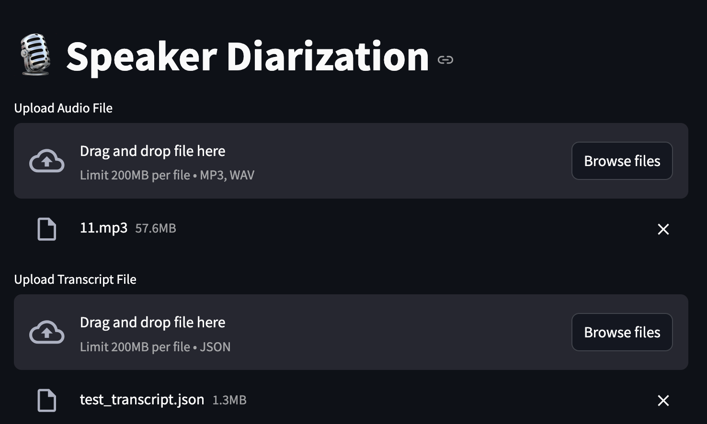
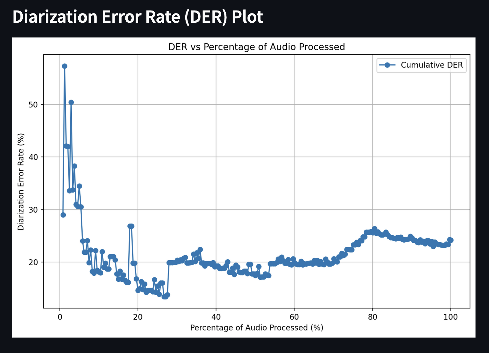

# Speaker Diarization

- Python3.11
## Overview

This project implements a speaker diarization system using the `pyannote.audio` library. The system processes audio files to identify and differentiate between speakers, providing a diarization error rate (DER) plot to evaluate performance. We use the pipeline from huggingface to perform the speaker diarization, since it combines both the segmentation and speaker diarization in one pipeline for us.  A more detailed explanation of the pipeline can be found [here](https://huggingface.co/pyannote/speaker-diarization-3.1).

The TLDR of the speaker diarization pipeline can be observed in the following image:


## Features

- **Speaker Diarization**: Identifies and segments speakers in an audio file.
- **Diarization Error Rate (DER) Calculation**: Computes the DER to evaluate the accuracy of the diarization.
- **Streamlit Integration**: Provides a web interface for uploading audio and transcript files and visualizing results.
- **Device Compatibility**: Automatically selects the best available device (CPU, CUDA, or MPS) for processing. (note: CUDA is recommended for faster processing)

## Installation

1. **Clone the repository**:
   ```bash
   git clone https://github.com/akramsystems/speaker-diarization-pipeline.git
   cd speaker-diarization-pipeline
   ```

2. **Set up a virtual environment**:
   ```bash
   python -m venv venv
   source venv/bin/activate
   ```

3. **Install dependencies**:
   ```bash
   pip install -r requirements.txt
   ```

4. **Set up environment variables**:
   - Create a `.env` file in the root directory.
   - Add your Hugging Face token:
     ```
     HF_TOKEN=your_huggingface_token
     ```
    make sure to accept the terms of using the speaker diarization model from Hugging Face [link here](https://huggingface.co/pyannote/speaker-diarization-3.1)

## Usage

### Streamlit Web Interface

1. **Start the Streamlit app**:
   ```bash
   python -m streamlit run src/app.py
   ```

2. **Upload files**:
   - Use the web interface to upload an audio file and its corresponding transcript, the pipeline will automatically process once both files are uploaded.

    

3. **Wait for the pipeline to finish**:
   - It takes a while, I was using an m1 2020 macbook pro, it took about 10 minutes.

    

3. **View results**:
   - The app will display a plot of the Diarization Error Rate (DER) over the percentage of audio processed.
   - it should also save the plot to the `outputs/accuracy_plots` directory.

    

## Project Structure

- `src/`: Contains the main source code.
  - `audiofile.py`: Handles audio file processing.
  - `pipeline.py`: Implements the speaker diarization pipeline.
  - `config.py`: Manages configuration settings.
  - `util.py`: Contains utility functions, including Streamlit progress hooks.
- `dataset/`: Directory for uploading/storing audio and transcript files.
- `outputs/`: Directory for storing output files, including RTTM file and DER plots.
- `.streamlit/config.toml`: Configuration for Streamlit.

## License

This project is licensed under the MIT License. See the [LICENSE](LICENSE) file for details.
